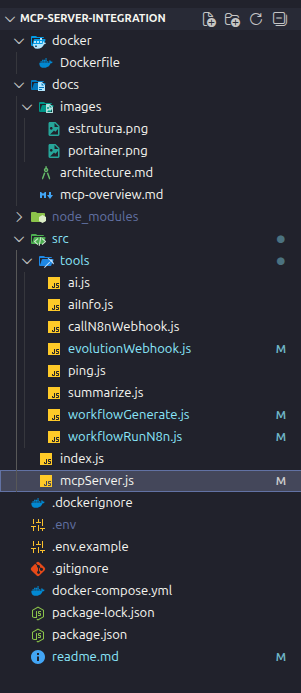

# MCP Server Integration

Este repositório demonstra a integração de um MCP Server (Model Context Protocol) com OpenAI, n8n e outros serviços, rodando em ambiente Docker, com código enxuto, arquitetura real e boas práticas de backend e segurança.

O projeto foi desenvolvido como um ambiente real de estudos, simulando cenários de produção com uso de containers, variáveis de ambiente, fallback de IA, timeout, retry, observabilidade básica e proteção de rotas.

## Objetivo do Projeto

- Implementar um MCP Server centralizado em Node.js
- Expor ferramentas MCP via REST com segurança
- Integrar o MCP com OpenAI, n8n e Evolution API
- Demonstrar uso de Docker e Docker Compose
- Aplicar middlewares de autenticação e controle de taxa (Rate Limit)

## O que é um MCP Server

O Model Context Protocol permite que agentes de IA utilizem ferramentas externas de forma organizada, reutilizável e desacoplada.

O MCP Server atua como uma camada intermediária responsável por centralizar integrações, padronizar respostas e aplicar regras de fallback, timeout e segurança.

## Arquitetura Geral

Cliente ou IA consome o MCP Server, que por sua vez se comunica com OpenAI, n8n e APIs externas. O acesso às ferramentas críticas é protegido por validação de chave de API.

## Estrutura do Projeto

## Execução com Docker

Pré-requisitos:

- Docker
- Docker Compose

Para subir o ambiente:

docker compose up -d

Para acompanhar os logs:

docker compose logs -f mcp-server

## Segurança e Middlewares

O projeto implementa middlewares para garantir a robustez e segurança da aplicação.

### Autenticação (Auth Middleware)

As rotas sensíveis são protegidas e exigem o cabeçalho `x-api-key`.
A validação é feita via variável de ambiente `MCP_API_KEYS`.

### Rate Limit

Middleware aplicado para prevenir abuso da API, limitando o número de requisições por IP em um determinado intervalo de tempo.

## Ferramentas e Rotas Disponíveis

### Rotas Públicas

#### Health Check

GET /

Retorna o status do MCP Server e versão atual.

#### Ping

GET /tools/ping

Teste simples de conectividade.

### Rotas Protegidas (Requer x-api-key)

#### Integração com n8n

POST /tools/n8n

Permite disparar webhooks do n8n a partir do MCP Server.

#### Tool de IA

POST /tools/ai

- Integração com OpenAI
- Fallback automático
- Timeout e retry configurados

#### Diagnóstico da IA

GET /tools/ai/info

Retorna informações de diagnóstico sem consumir tokens.

#### Webhook Evolution

POST /webhook/evolution

Recebe e processa eventos da Evolution API.

#### Execução de Workflow

POST /tools/workflow/run

Executa um workflow específico no n8n.

#### Geração Automática de Workflow no n8n

POST /tools/workflow/generate

Cria workflows automaticamente no n8n.

Funcionalidades:

- Criação dinâmica de workflow
- Definição automática de webhook
- Publicação direta no n8n
- Retorno da URL do webhook

Exemplo de resposta:

{ \
"tool": "workflow-generate",\
"status": "ok",\
"workflowId": "jb6tL0eKiPLgehPR",\
"webhookUrl": "https://webhook.camiloruas.dev/webhook/auto-ping"  \
}

## Containers em Execução

O projeto roda em servidor self-hosted com gerenciamento via Portainer.

Imagem :

## Domínios Utilizados

- mcp.camiloruas.dev
- n8n.camiloruas.dev
- webhook.camiloruas.dev
- portainer.camiloruas.dev

A exposição externa é feita via Cloudflare Tunnel.

## Boas Práticas Aplicadas

- Arquitetura enxuta
- Variáveis sensíveis fora do versionamento
- Middlewares de segurança (Auth, Rate Limit)
- Containers isolados
- Fallback de IA

## Autor

Camilo Ruas

GitHub:
https://github.com/Camiloruas

LinkedIn:
https://www.linkedin.com/in/camilo-ruas-3a2a6425/

Projeto em constante evolução.
